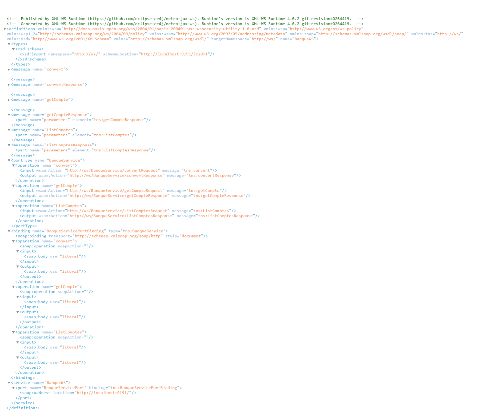

# Projet Web Service de Banque

Ce projet consiste à créer un web service simple de banque utilisant Jakarta EE. Il expose des opérations pour convertir des montants, obtenir des informations de compte et lister des comptes.

## Contenu du projet

Le projet comprend trois fichiers principaux :
1. **BanqueService.java**
    - Définit un service web avec trois méthodes :
        - **conversion** : Convertit un montant en utilisant un taux de change fixe.
        - **getCompte** : Retourne les informations d'un compte donné par son code.
        - **ListComptes** : Retourne une liste de comptes.

2. **Compte.java**
    - Définit la classe `Compte`, représentant un compte bancaire avec des attributs comme le code, le solde et la date de création.

3. **ServerJWS.java**
    - Lance le serveur web service sur l'adresse `http://0.0.0.0:9191/`.

## Déploiement

Pour déployer le service web, exécutez la classe `ServerJWS`. Le service sera disponible à l'adresse `http://0.0.0.0:9191/`.

## Tests

### Utilisation de SoapUI

1. **Conversion de Montant**
   - Créez une nouvelle requête SOAP dans SoapUI.
   - Utilisez l'URL `http://localhost:9191/BanqueWS?wsdl`.
   - Choisissez l'opération `convert`.
   - Fournissez un montant dans le corps de la requête.
   - Capturez l'écran du résultat.

   

2. **Obtention d'un Compte**
   - Créez une nouvelle requête SOAP dans SoapUI.
   - Utilisez l'URL `http://localhost:9191/BanqueWS?wsdl`.
   - Choisissez l'opération `getCompte`.
   - Fournissez un code de compte dans le corps de la requête.
   - Capturez l'écran du résultat.

   

3. **Liste des Comptes**
   - Créez une nouvelle requête SOAP dans SoapUI.
   - Utilisez l'URL `http://localhost:9191/BanqueWS?wsdl`.
   - Choisissez l'opération `ListComptes`.
   - Capturez l'écran du résultat.

   
### Accès au WSDL

Ouvrez un navigateur et accédez à l'URL `http://localhost:9191/?wsdl`. Capturez l'écran de la page affichant le WSDL.

## Conclusion

Ce projet montre comment créer un web service simple avec Jakarta EE et comment le tester en utilisant SoapUI. Les tests décrits ci-dessus montrent comment interagir avec les différentes méthodes exposées par le service web.

